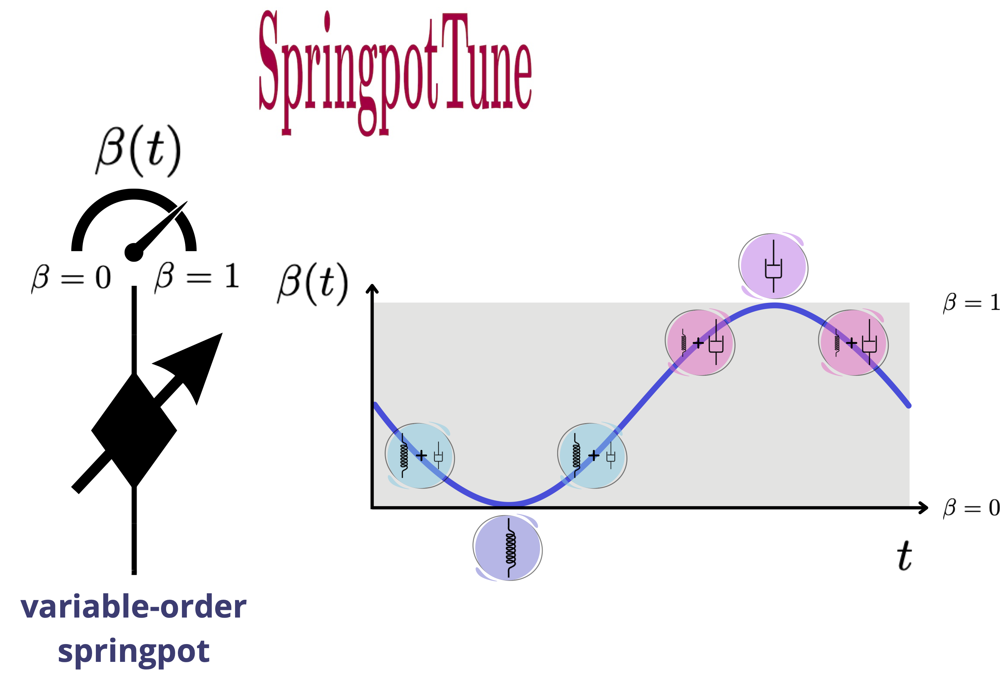

## Variable-Order Springpot Model Tuning via Cross-Entropy Method

**SpringpotTune: Variable-Order Springpot Model Tuning via Cross-Entropy Method** is a Matlab package designed to fit variable-order springpot models (fractional rheological elements) using the Cross-Entropy (CE) method for global optimization. With simple adaptations, the SpringpotFit framework can be extended to optimize other variable-order fractional models in rheology and time-dependent systems, offering a versatile and robust approach to parameter identification.

<p align="center">

</p>

**SpringpotTune** uses as optimization tool the package **CEopt - Cross-Entropy Optimizer**, which can be downloaded at <a href="https://ceopt.org" target="_blank">https://ceopt.org</a>.

### Table of Contents
- [Overview](#overview)
- [Features](#features)
- [Usage](#usage)
- [Documentation](#documentation)
- [Reproducibility](#reproducibility)
- [Authors](#authors)
- [Citing FracTune](#citing-fractune)
- [License](#license)
- [Institutional support](#institutional-support)
- [Funding](#funding)

### Overview
**SpringpotTune** was developed to fit variable-order springpot models for rheological systems by addressing nonconvex optimization problems using the Cross-Entropy (CE) method. The underlying results are reported in the following publication:
- *J. G. Telles Ribeiro and A. Cunha Jr, Advanced creep modeling of polypropylene: A variable-order fractional calculus approach, 2025 (under review)*

Preprint available here.

### Features
- Implements the Cross-Entropy method for fitting variable-order springpot models
- Transparent "gray-box" optimizer offering intuitive control over key parameters
- Robust and scalable for moderately complex fitting problems in rheological systems
- Demonstrated versatility and effectiveness through case studies of variable-order fractional models

### Usage
To get started with **SpringpotTune**, follow these steps:
1. Clone the repository:
   ```bash
   git clone https://github.com/americocunhajr/SpringpotTune.git
   ```
2. Navigate to the code directory:
   ```bash
   cd SpringpotTune/SpringpotTune-1.0
   ```
3. To calibrate the Springpot model, execute the main file:
   ```bash
   Main_VOSpringpot_Calibration1
   ```

This package includes the following files:
* Main_VOSpringpot_Calibration1.m --- Calibrates the variable-order springpot model parameters (elastic modulus, viscosity, initial & asymptotic fractional orders, characteristic time, deformation rate) to experimental creep data
* Main_VOSpringpot_Calibration2.m --- Performs a second calibration stage using a phenomenological equation to capture the load-dependent behavior of the mechanical properties. This script uses the CEopt black-box package (without exposing the internal CEopt code) and compares the calibrated phenomenological curve against reference values obtained from the first calibration
* Main_VOSpringpot_StrainCurves.m --- Computes and plots the strain evolution curve for a chosen material (PP or PVC) and load using the calibrated variable-order springpot model. The script reads the experimental data from CSV files, automatically discovers the available loads, and then filters the data for the selected load value
* CEopt.m -- Cross-entropy solver
* CreepDataPP.csv: Contains creep test data for polypropylene (PP) with columns for load (MPa), time (days), and strain (%)
CreepDataPVC.csv: Contains creep test data for polyvinyl chloride (PVC) with columns for load (MPa), time (days), and strain (%)
* PlotSemilogx2.m -- Auxiliary function to plot two curves from given datasets in semilogx scale
* PlotLoglog2.m -- Auxiliary function to plot two curves from given datasets in loglog scale
* Plot2.m -- Auxiliary function to plot two curves from given datasets in linear scale

### Documentation
The routines in **SpringpotTune** are well-commented to explain their functionality. Each routine includes a description of its purpose, inputs, and outputs. 

### Reproducibility

Simulations done with **SpringpotFit** are fully reproducible, as can be seen on this <a href="https://codeocean.com/capsule/48587289-b12b-49b5-9188-938ce435acd1/" target="_blank">CodeOcean capsule</a>.

### Authors
- José Geraldo Telles Ribeiro
- Americo Cunha Jr

### Citing SpringpotTune
We ask the package users to cite the following manuscript in any publications reporting work done with our code or data:
- *J. G. Telles Ribeiro and A. Cunha Jr, Advanced creep modeling of polypropylene: A variable-order fractional calculus approach, 2025 (under review)*

```
@article{TellesRibeiro2024SpringpotTune,
   author  = {J. G. {Telles Ribeiro} and A. {Cunha~Jr}},
   title   = "{Advanced creep modeling of polypropylene: A variable-order fractional calculus approach}",
   journal = {Under Review},
   year    = {2025},
   volume  = {~},
   pages   = {~},
   doi    = {~},
}
```

### License
**SpringpotTune** is released under the MIT license. See the LICENSE file for details. All new contributions must be made under the MIT license.

 

### Institutional support

 &nbsp; &nbsp; &nbsp; 

### Funding

 &nbsp; &nbsp;   &nbsp; &nbsp; &nbsp; 
